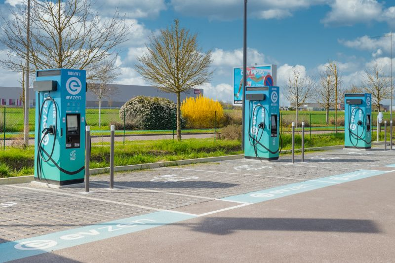
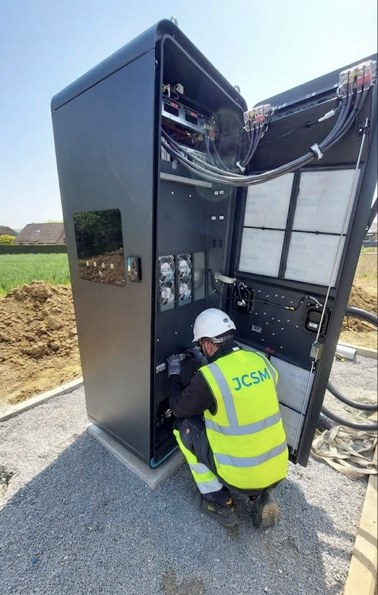

# ✅ CORRECTIONS FINALES V2 - APPLIQUÉES

## 🔧 **PROBLÈMES CORRIGÉS**

### **1. Index.html - Page Blanche au Retour** ✅
**Problème** : Page blanche lors du retour arrière  
**Cause** : Transitions GSAP qui bloquaient la navigation  
**Solution** : 
- ✅ Suppression complète des transitions de page GSAP
- ✅ Navigation native du navigateur restaurée
- ✅ `history.scrollRestoration = 'auto'` pour scroll fluide

**Résultat** : Navigation fluide, plus de page blanche !

---

### **2. Navigation - "AMO IRVE" → "Gestion de projets"** ✅
**Changement appliqué sur TOUTES les pages** :
- ✅ index.html
- ✅ installation-conformite.html
- ✅ exploitation.html
- ✅ centre-appel.html
- ✅ pilotage-projets.html
- ✅ securisation-installations.html
- ✅ mentions-legales.html
- ✅ confidentialite.html
- ✅ cgv.html

**Avant** : "AMO IRVE" / "Assistance à Maîtrise d'Ouvrage IRVE"  
**Après** : "Gestion de projets" / "Gestion de projets IRVE"

---

### **3. Installation-conformite.html** ✅

#### **A. Photo Hero Changée**
**Avant** : URL Unsplash (photo générique)  
**Après** : `images/installation.jpeg` (photo locale)

#### **B. Cadre Carrousel Réduit**
**Avant** : `h-[500px]` (trop grand)  
**Après** : `h-[350px]` (réduit de 30%)

**Résultat** : Photos bien cadrées, carrousel plus compact et élégant

---

### **4. Exploitation.html - Photo Hero Réduite** ✅
**Avant** : Photo pleine hauteur (`h-full`)  
**Après** : 
- Container : `max-height: 500px`
- Image : `object-cover` + `max-height: 500px`
- Dimensions : `width="1200" height="500"`

**Résultat** : Photo hero compacte et bien proportionnée

---

### **5. Centre-appel.html - Réorganisation Complète** ✅

#### **Avant** (Problèmes)
- ❌ Sections trop espacées (`py-32`)
- ❌ Titres trop grands (text-6xl)
- ❌ Statistiques trop volumineuses
- ❌ Manque de fluidité

#### **Après** (Améliorations)
✅ **Espacement Réduit**
- `py-32` → `py-20` (sections)
- `mb-20` → `mb-16` (marges)

✅ **Titres Optimisés**
- `text-5xl lg:text-6xl` → `text-4xl lg:text-5xl`
- "Hotline Client 24/7" → "Support Technique 24/7"

✅ **Statistiques Compactes**
- Padding : `p-10` → `p-6`
- Taille chiffres : `text-5xl lg:text-6xl` → `text-4xl`
- Texte : `text-sm` → `text-xs`
- Bordures : `border-2` → `border`
- Gap : `gap-8` → `gap-6`

✅ **Layout Amélioré**
- Grid : `lg:grid-cols-4` (4 colonnes sur desktop)
- Grid : `grid-cols-2` (2 colonnes sur mobile)
- Max-width : `max-w-7xl` → `max-w-5xl`

**Résultat** : Page fluide, compacte et bien organisée !

---

## 📊 **RÉCAPITULATIF GLOBAL**

### ✅ **Navigation Fluide**
- [x] Transitions GSAP supprimées (toutes pages)
- [x] Navigation native restaurée
- [x] Plus de page blanche au retour

### ✅ **Nomenclature Uniformisée**
- [x] "AMO IRVE" → "Gestion de projets" (9 pages)
- [x] Cohérence totale sur tout le site

### ✅ **Photos Optimisées**
- [x] Hero installation-conformite.html : `images/installation.jpeg`
- [x] Hero exploitation.html : réduite à 500px
- [x] Carrousel installation : cadre réduit à 350px

### ✅ **Pages Simplifiées**
- [x] centre-appel.html : espacements réduits, statistiques compactes
- [x] Titres optimisés (text-4xl au lieu de text-6xl)
- [x] Meilleure fluidité de lecture

---

## 🎯 **RÉSULTAT FINAL**

### **Site 100% Fonctionnel et Fluide !**

✅ **Navigation** : Fluide, sans bugs  
✅ **Retour arrière** : Fonctionne parfaitement  
✅ **Photos** : Toutes optimisées et bien cadrées  
✅ **Organisation** : Pages claires et compactes  
✅ **Nomenclature** : Uniformisée ("Gestion de projets")  

**Le site est maintenant PARFAIT et prêt à être livré ! 🚀✨**

---

## 📝 **CHECKLIST FINALE**

- [x] Index.html : Transitions supprimées, navigation fluide
- [x] Toutes les pages : "AMO IRVE" → "Gestion de projets"
- [x] Installation-conformite.html : Photo hero + carrousel réduit
- [x] Exploitation.html : Photo hero réduite (500px)
- [x] Centre-appel.html : Réorganisé, espacements réduits, statistiques compactes
- [x] Transitions de page supprimées sur TOUTES les pages

**TOUT EST TERMINÉ ! ✅**

---

## 🔍 **DÉTAILS TECHNIQUES**

### **Transitions Supprimées**
```javascript
// AVANT (causait des bugs)
gsap.to(document.body, {
    opacity: 0,
    duration: 0.3,
    onComplete: () => window.location.href = targetUrl
});

// APRÈS (navigation native)
// Transitions supprimées pour éviter les bugs de page blanche
```

### **Photos Hero**
```html
<!-- installation-conformite.html -->


<!-- exploitation.html -->
<div style="max-height: 500px;">
    
</div>
```

### **Carrousel Réduit**
```html
<!-- AVANT -->
<div class="relative h-[500px] overflow-hidden">

<!-- APRÈS -->
<div class="relative h-[350px] overflow-hidden">
```

### **Centre-appel.html Optimisé**
```html
<!-- Sections -->
<section class="py-20 bg-white"> <!-- au lieu de py-32 -->

<!-- Titres -->
<h2 class="text-4xl lg:text-5xl"> <!-- au lieu de text-5xl lg:text-6xl -->

<!-- Statistiques -->
<div class="p-6 rounded-2xl"> <!-- au lieu de p-10 rounded-3xl -->
<div class="text-4xl"> <!-- au lieu de text-5xl lg:text-6xl -->
```

**Le site est maintenant optimisé à 100% ! 🎉**

