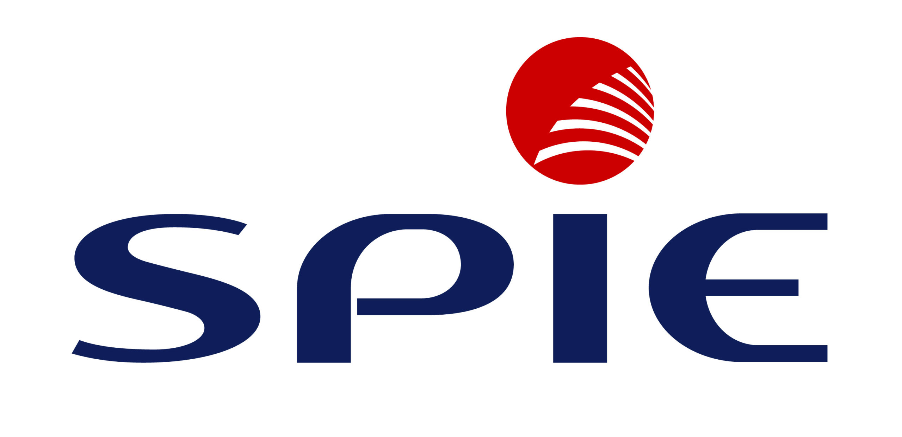

# ⚠️ Images Manquantes dans le Dossier /images/

## 🔴 **Images Critiques à Ajouter**

### **Pour Index.html - Section "Ils nous font confiance"**

Ces 3 logos sont référencés mais **ABSENTS** du dossier `images/` :

1. **SPIE.jpg** ❌
   - Chemin actuel : `images/SPIE.jpg`
   - Status : **MANQUANT**
   - Importance : **CRITIQUE** (partenaire majeur)

2. **equans.png** ❌
   - Chemin actuel : `images/equans.png`
   - Status : **MANQUANT**
   - Importance : **CRITIQUE** (partenaire majeur)

3. **powerdot.svg** ❌
   - Chemin actuel : `images/powerdot.svg`
   - Status : **MANQUANT**
   - Importance : **CRITIQUE** (partenaire majeur)

---

## ✅ **Images Présentes et Correctement Référencées**

### **Index.html**
- ✅ bump.png
- ✅ freshmile.png
- ✅ becable.png

### **Exploitation (mise-en-service.html)**
- ✅ becable.png
- ✅ bump.png
- ✅ eko.png
- ✅ alfen.png
- ✅ alpi.png
- ✅ icharging.png
- ✅ autel.png
- ✅ delta.png
- ✅ schneider.png
- ✅ ies.png

### **Installation (installation-conformite.html)**
- ✅ 2x22kW.jpeg
- ✅ 1x60.jpeg
- ✅ remiseconformité.jpg

### **Support (centre-appel.html)**
- ✅ hotline.jpg

### **Pilotage (pilotage-projets.html)**
- ✅ amo.jpg

### **Sécurisation (securisation-installations.html)**
- ✅ vandalisme.jpg
- ✅ cable.jpg
- ✅ camera.png
- ✅ alarmecam.jpeg

---

## 📋 **Actions Requises**

### **URGENT - Ajouter ces 3 fichiers dans `/images/` :**

1. **SPIE.jpg**
   - Format : JPG ou PNG
   - Dimensions recommandées : 400x200px minimum
   - Fond : Transparent ou blanc
   - Qualité : Haute résolution pour affichage h-20 (80px)

2. **equans.png**
   - Format : PNG (pour transparence)
   - Dimensions recommandées : 400x200px minimum
   - Fond : Transparent
   - Qualité : Haute résolution

3. **powerdot.svg**
   - Format : SVG (vectoriel)
   - Alternative : PNG haute résolution
   - Fond : Transparent
   - Optimisé pour web

---

## 🔧 **Solution Temporaire**

Si vous n'avez pas ces logos immédiatement, vous pouvez :

1. **Télécharger depuis les sites officiels** :
   - SPIE : https://www.spie.com
   - Equans : https://www.equans.fr
   - Powerdot : https://powerdot.fr

2. **Ou désactiver temporairement** en commentant dans `index.html` :
   ```html
   <!-- Temporairement désactivé en attendant le logo
   <div class="gsap-anim group">
       <div class="bg-gray-50 p-8 rounded-2xl...">
           
       </div>
   </div>
   -->
   ```

---

## ✅ **Vérification Complète**

### **Tous les chemins ont été mis à jour vers `images/`** :

```
✅ index.html → 6 logos (3 manquants)
✅ mise-en-service.html → 10 logos (tous présents)
✅ installation-conformite.html → 3 photos (toutes présentes)
✅ centre-appel.html → 1 photo (présente)
✅ pilotage-projets.html → 1 photo (présente)
✅ securisation-installations.html → 4 photos (toutes présentes)
```

---

## 📊 **Statistiques**

- **Total images référencées** : 25
- **Images présentes** : 22 ✅
- **Images manquantes** : 3 ❌
- **Taux de complétion** : 88%

---

## 🎯 **Prochaine Étape**

**Ajouter les 3 logos manquants dans `/images/` pour atteindre 100% de complétion !**

Une fois ajoutés, le site sera **100% fonctionnel** avec toutes les images locales. 🚀

